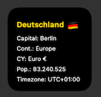

# country-information.js
A Scriptable widget that shows different informations about a country. 
The country is determined via the IP address or static input.




<p>
   <a href="#description">Setup</a> • 
   <a href="#setup">Setup</a> •
   <a href="#usage">Usage</a> •
   <a href="#links">Links</a> •
   <a href="#contribution">Contribution</a> •
   <a href="#roadmap">Roadmap</a> •
 </p>

## Description
Displays different informations about a country, chosen by the ip location or a static input.

## Setup

1. (if not done yet) Download the scriptable app form [AppStore](https://apps.apple.com/de/app/scriptable/id1405459188)
2. In Scriptable create a new script
3. Copy the code from script file
4. Create a new widget on homescreen and select this script in scriptable

## Usage
If you want to use your location do not change line 14.

If you want to use a specific land, change line 14 like in the example. You have to write the complete country name.
```javascript
let country = "germany"; 
```

## Links
- REST Countries: https://restcountries.com/#rest-countries
- IP Adress: https://ip-api.com


## Contribution

If you have any ideas for extensions or changes just let me know.

## Roadmap
- Errorhandling DONE
